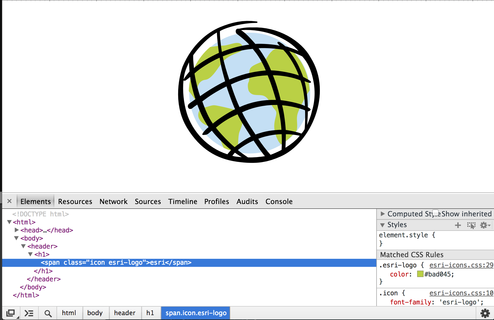

# Three Color Icons



Using IcoMoon icon fonts with ligatures is a great way to bring a large family of icons into your site, with benefits ranging from semantic icon tags, tiny file size, control over color, and the inherent advantages of vector rendering on high pixel density hardware. This technique expands that benefit into multi-color icons, using :before and :after elements to create three layers with three colors. 

## Color Separations
In a normal ligature-enabled icon font, each icon is a single .svg mapped to a single ligature. Our three color icons expand on that idea - each color layer of each icon is a single .svg, mapped to a unique ligature. In the case of our three esri layers, these ligatures are esri, esrifront, and esriback. Keeping the names of each icon related maintains semantic clarity with multiple layers for multiple icons. The layers sit on top of each other, so separate the colors with an eye to this. Broad color fills are usually good background layers, but the any color overlap of precise connection needs proper trapping and arrangement. Generate a single font with all the layers of all your icons - there is practically no limit to how many icons you can store, as each one maps to it's own unique set of characters. 

## Implementation
The CSS that IcoMoon includes with the generated font is an ideal place to start. Creating a class called icon, we can call the icon font within a span. Each icon also needs it's own class, so we can match each icon it with its layers. The :after pseudo-element is the top layer, and the :before pseudo-element is the bottom layer. Since each icon is drawn on a square, aligning all three icons is as simple as giving each pseudo-element a negative margin of 1em. This will perfectly align each  layer at every font size.

In this same section, we can also define the colors of each layer. The final html markup is as simple as creating a span with a class setting the font family to the icons, a class pulling out the correct layers for the icon, than the ligature word that creates the icon. 

```
/* Set .icon to use the icon font */
.icon {
  font-family: 'esri-logo';
}

/* Set the central layer to green */
.esri-logo {color: #bad045;'}

/* Set the background layer ligature an color */
.esri-logo:after {content:"esrifront"; color: #000000}

/* Set the foreground layer ligature an color */
.esri-logo:before {content:"esriback"; color: #c4dff4}


/* Create the ligature that puts it all together */
<span class="icon esri-logo">esri</span>	
```

#### example: http://nikolaswise.github.io/three-color-icons/esri-logo.html